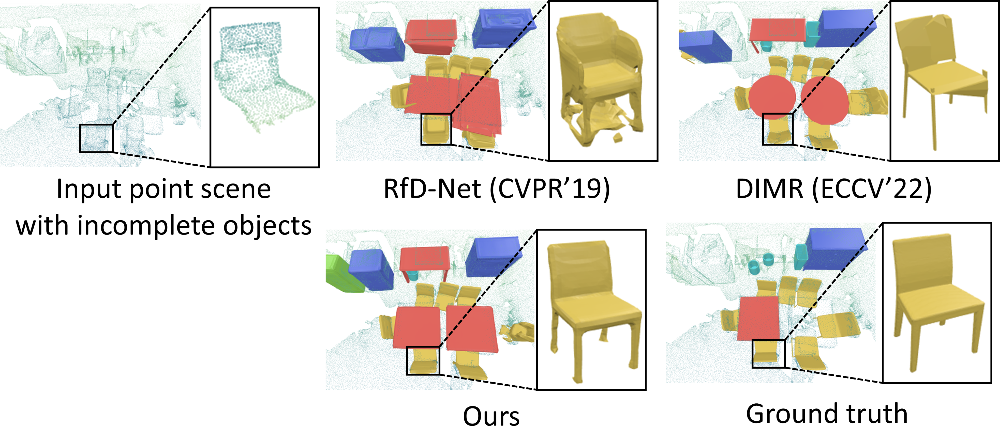
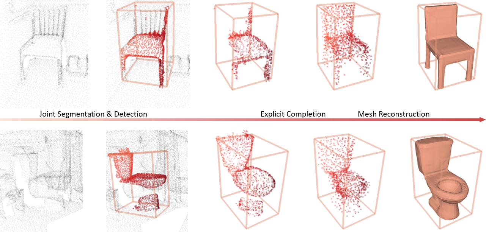
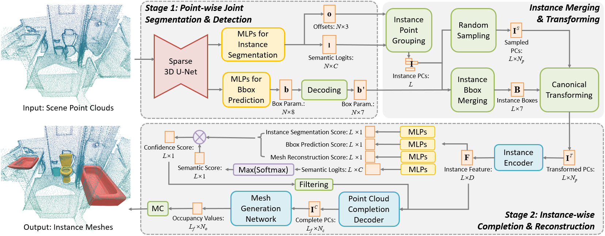

# JIMR: Joint Semantic and Geometry Learning for Point Scene Instance Mesh Reconstruction (TVCG 2024)
This repository contains the official implementation for the paper: [JIMR: Joint Semantic and Geometry Learning for Point Scene Instance Mesh Reconstruction ](https://ieeexplore.ieee.org/document/10526474). [IEEE Transactions on Visualization and Computer Graphics'24]

Given an uncolored 3D point cloud of a indoor scene, JIMR recognizes instance objects with bounding boxes and segmented points, then reconstructs corresponding meshes.



To do so, a network with two cascaded stages is designed:


## 📝Todo
- [x] Release code for inference. 2024.05.22
- [ ] clean and reorganize the code
- [ ] Release code for demo (quick inference without GT)
- [ ] Release code for training
- [ ] Release code for evaluation
- [ ] Release code for visualization

## 🛠️ Setup
- Different from the paper: We used torch 1.7.0 and spconv1.0 in the experiments of the paper. Here we update to torch 1.7.1 and spconv2.0. Spconv2.0 is much more easier to install than spconv1.0.

- We test our codes under the following environment: `Ubuntu 18.04.5, Python 3.8.19, CUDA 11.0`.
- We use spconv2 for the sparse convolution backbone. To support this, please make sure that your cuda version is bigger than 11.0.

1. Clone this repository.
```bash
git clone git@github.com:YuQiao0303/JIMR.git
cd JIMR
```

1. Install python packages. **Modify the code according to your own cuda version**:
```bash
conda create --name jimr python=3.8
conda activate jimr

pip install torch==1.7.1 -f https://download.pytorch.org/whl/cu110/torch_stable.html # replace to your own cuda version

pip install spconv-cu113 # if your cuda version is cuda11.x, use this line
# pip install spconv-cu120 # if your cuda version is cuda12.x, use this line

pip install -r requirements.txt
```

3. Install extentions:
- ext_PG_OP
```bash
# developed by us
cd lib/ext_PG_OP
python setup.py develop
```
- PG_OP
```bash
# https://github.com/dvlab-research/PointGroup
cd lib/pointgroup_ops
python setup.py develop
```
If `/home/yuqiao/dimr/lib/pointgroup_ops/src/datatype/datatype.h:7:10: fatal error: google/dense_hash_map: No such file or directory
 #include <google/dense_hash_map>`, try:
 ```bash
 apt-get install libsparsehash-dev 
 ```
reference:  https://github.com/facebookresearch/SparseConvNet/issues/96

- rotated iou:
```bash
# https://github.com/lilanxiao/Rotated_IoU
cd lib/rotated_iou/cuda_op
python setup.py develop
```

- libmise:
```bash
# https://github.com/autonomousvision/occupancy_networks/tree/406f79468fb8b57b3e76816aaa73b1915c53ad22
cd lib/libmise
python setup.py build_ext --inplace
```

- chamfer distance: 
```bash
# https://github.com/ThibaultGROUEIX/ChamferDistancePytorch/tree/master/chamfer3D
cd lib/chamfer_distance
python setup.py develop
```

## 💾Prepare the data

We aim to organize our dataset folder as following:
```bash
.
├──datasets
│   ├── scannet
│   │   ├── scannetv2-labels-combined.tsv # scannet label mappings
│   │   ├── processed_data # preprocessed data
│   │   │   ├── scene0000_00 
│   │   │   │   ├── bbox.pkl
│   │   │   │   ├── data.npz
│   │   │   ├── ......
│   │   │   ├── scene0706_00
│   │   ├── rfs_label_map.csv # generated label mappings
│   ├── ShapeNetv2_data # preprocessed shapenet dataset
│   │   ├── watertight_scaled_simplified
│   │   ├── watertight_scaled_simplified
│   │   ├── watertight_scaled_simplified
│   ├── splits # data splits
│   │   ├── train.txt
│   │   ├── val.txt
│   │   ├── test.txt
```

To do so:
* download the data preprocesssed by [DIMR](https://github.com/ashawkey/dimr) authors [here](https://drive.google.com/file/d/1lJUWMQ2g-a1r2QGjawpgU3jVCCqF-DLO/view?usp=sharing) (~3.3G).


* download the preprocessed ShapeNet (simplified watertight mesh) following [RfDNet](https://github.com/GAP-LAB-CUHK-SZ/RfDNet) into `ShapeNetv2_data`, only the `watertight_scaled_simplified`, `points`, `point_cloud` are used.


Our pretrained weight of JIMR can be downloaded from: [this Google Drive link](https://drive.google.com/file/d/1fXYDLffHUC3egB8ZaUaWO8EeFfk093FI/view?usp=sharing). 
You can 
put it in the root path as ```/jimr/jimr_spconv2.pth```, or anywhere you want, but modify the config files accordingly.
## 💻Usage
### Run inference:
```bash
CUDA_VISIBLE_DEVICES=0 python test.py --config config/test_phase2_scannet.yaml
```
The results will be saved in ```exp/scannetv2/rfs/test_phase2_scannet```. You can drag the files into Meshlab to visualize them.

## 🎉Acknowledgement
This work is built on many amazing research works and open-source projects, thanks a lot to all the authors for sharing!
- [RfDNet](https://github.com/GAP-LAB-CUHK-SZ/RfDNet)
- [DIMR](https://github.com/ashawkey/dimr)


## 📚Citation
If you find our work useful in your research, please consider citing our paper. We will update the citation information soon.
<!-- ```
@ARTICLE{10526474,
  author={Yu, Qiao and Li, Xianzhi and Tang, Yuan and Xu, Jinfeng and Hu, Long and Hao, Yixue and Chen, Min},
  journal={IEEE Transactions on Visualization and Computer Graphics}, 
  title={JIMR: Joint Semantic and Geometry Learning for Point Scene Instance Mesh Reconstruction}, 
  year={2024},
  volume={},
  number={},
  pages={1-13},
  keywords={Task analysis;Three-dimensional displays;Semantics;Proposals;Instance segmentation;Shape;Point cloud compression;3D reconstruction;3 d scene understanding;instance mesh reconstruction},
  doi={10.1109/TVCG.2024.3398737}}

``` -->


