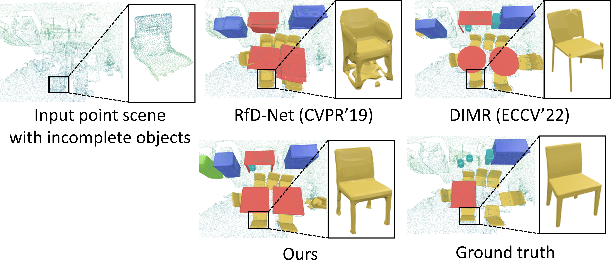
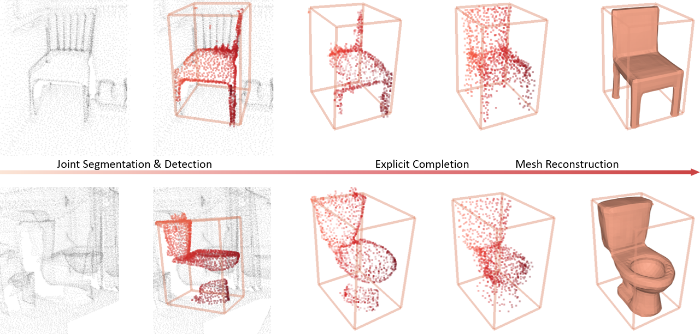
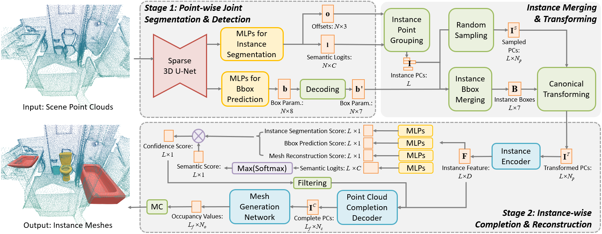

# JIMR: Joint Semantic and Geometry Learning for Point Scene Instance Mesh Reconstruction (TVCG 2024)
This repository contains the official implementation for the paper: [JIMR: Joint Semantic and Geometry Learning for Point Scene Instance Mesh Reconstruction ](https://ieeexplore.ieee.org/document/10526474). [IEEE Transactions on Visualization and Computer Graphics'24]

Given an uncolored 3D point cloud of a indoor scene, JIMR recognizes instance objects with bounding boxes and segmented points, then reconstructs corresponding meshes.



To do so, a network with two cascaded stages is designed:


## News
- 2025.12.09 Training code released!
- 2025.02.16 update google drive link
## 📝Todo
- [x] Release code for inference. 2024.05.22
- [ ] clean and reorganize the code
- [ ] Release code for demo (quick inference without GT)
- [x] Release code for training 2025.12.09
- [x] Release code for evaluation 2026.01.06
- [ ] Release code for visualization

## 🛠️ Setup
- Different from the paper: We used torch 1.7.0 and spconv1.0 in the experiments of the paper. Here we update to torch 1.7.1 and spconv2.0. Spconv2.0 is much more easier to install than spconv1.0.

- We test our codes under the following environment: `Ubuntu 18.04.5, Python 3.8.19, CUDA 11.0`.
- We use spconv2 for the sparse convolution backbone. To support this, please make sure that your cuda version is bigger than 11.0.

1. Clone this repository.
```bash
git clone git@github.com:YuQiao0303/JIMR.git
cd JIMR
```

1. Install python packages. **Modify the code according to your own cuda version**:
```bash
conda create --name jimr python=3.8
conda activate jimr

pip install torch==1.7.1 -f https://download.pytorch.org/whl/cu110/torch_stable.html # replace to your own cuda version

pip install spconv-cu113 # if your cuda version is cuda11.x, use this line
# pip install spconv-cu120 # if your cuda version is cuda12.x, use this line

pip install -r requirements.txt
```

3. Install extentions:
- ext_PG_OP
```bash
# developed by us
cd lib/ext_PG_OP
python setup.py develop
```
- PG_OP
```bash
# https://github.com/dvlab-research/PointGroup
cd lib/pointgroup_ops
python setup.py develop
```
If `/home/yuqiao/dimr/lib/pointgroup_ops/src/datatype/datatype.h:7:10: fatal error: google/dense_hash_map: No such file or directory
 #include <google/dense_hash_map>`, try:
 ```bash
 apt-get install libsparsehash-dev 
 ```
reference:  https://github.com/facebookresearch/SparseConvNet/issues/96

- rotated iou:
```bash
# https://github.com/lilanxiao/Rotated_IoU
cd lib/rotated_iou/cuda_op
python setup.py develop
```

- libmise:
```bash
# https://github.com/autonomousvision/occupancy_networks/tree/406f79468fb8b57b3e76816aaa73b1915c53ad22
cd lib/libmise
python setup.py build_ext --inplace
```

- chamfer distance: 
```bash
# https://github.com/ThibaultGROUEIX/ChamferDistancePytorch/tree/master/chamfer3D
cd lib/chamfer_distance
python setup.py develop
```

- light-field-distance (only if you need LFD evaluation)
```bash
cd lib
git clone https://github.com/ashawkey/light-field-distance/tree/88031b227e0c5c91959b274a67161875637c0ef9
python setup.py install
```
## 💾Prepare the data

We aim to organize our dataset folder as following:
```bash
.
├──datasets
│   ├── scannet
│   │   ├── scannetv2-labels-combined.tsv # scannet label mappings
│   │   ├── processed_data # preprocessed data
│   │   │   ├── scene0000_00 
│   │   │   │   ├── bbox.pkl
│   │   │   │   ├── data.npz
│   │   │   ├── ......
│   │   │   ├── scene0706_00
│   │   ├── rfs_label_map.csv # generated label mappings
│   ├── ShapeNetv2_data # preprocessed shapenet dataset
│   │   ├── watertight_scaled_simplified
│   │   ├── point
│   │   ├── point_cloud
│   ├── splits # data splits
│   │   ├── train.txt
│   │   ├── val.txt
│   │   ├── test.txt
```

To do so:
* download the data preprocesssed by [DIMR](https://github.com/ashawkey/dimr) authors [here](https://drive.google.com/file/d/1lJUWMQ2g-a1r2QGjawpgU3jVCCqF-DLO/view?usp=sharing) (~3.3G).


* download the preprocessed ShapeNet (simplified watertight mesh) following [RfDNet](https://github.com/GAP-LAB-CUHK-SZ/RfDNet) into `ShapeNetv2_data`, only the `watertight_scaled_simplified`, `point`, `point_cloud` are used.


Our pretrained weight of JIMR can be downloaded from this Google Drive link: [https://drive.google.com/file/d/1dCmNHeZ3K-OS1jE1anEy4xfN8RgKRGTV/view?usp=drive_link](https://drive.google.com/file/d/1dCmNHeZ3K-OS1jE1anEy4xfN8RgKRGTV/view?usp=drive_link)
You can 
put it in the root path as ```/jimr/jimr_spconv2.pth```, or anywhere you want, but modify the config files accordingly.

### Download pretrained weights to train JIMR
If you want to train JIMR by yourself, you also needs to download some other pretrained weights:
for training jimr, prepare:
- dimr_spconv2.pth: [DIMR](https://github.com/ashawkey/dimr)'s weight, but we transform it from spconv1 to spconv2 by code in util/convert_checkopoint.py.
- ONet: [Occupancy Network](https://github.com/autonomousvision/occupancy_networks)'s weight, but we finetune it on the categories in JIMR.
- PCN: [PCN](https://github.com/wentaoyuan/pcn)'s weight.

We also provide our JIMR's pretrained phase1 checkpoint:
- jimr_trained_phase1_spconv2.pth: this checkpoint was original gained by training with spconv1. Hhere we tranwform it to spconv2.

The above pretrained weights can be downloaded from this link:
[https://drive.google.com/file/d/1Luqsqp7WGliPmXyMWeOOFBAGRqQQdLos/view?usp=sharing](https://drive.google.com/file/d/1Luqsqp7WGliPmXyMWeOOFBAGRqQQdLos/view?usp=sharing).

After downloading. Unzip this file, and organize the files as:
```bash
.
├──pretrained_weights
│   ├── dimr_spconv2.pth
│   ├── ONet.pth
│   ├── pcn.pth
│   ├── jimr_trained_phase1_spconv2.pth
│
```

## 💻Usage
### Training
Train phase1:
```bash
CUDA_VISIBLE_DEVICES=0 python train.py --config config/train_phase1_scannet.yaml
```
The results will be saved in ```exp/scannetv2/rfs/train_phase1_scannet```.


Train phase2:
```bash
CUDA_VISIBLE_DEVICES=0 python train.py --config config/train_phase2_scannet.yaml
```
The results will be saved in ```exp/scannetv2/rfs/train_phase2_scannet```.
To use your own trained phase1's weights, modify 'pretrain_path' in train_phase2_scannet.yaml

### Run inference:
> Note: If you need to also evaluate segmentaiton IoU and bbox IoU, you need to do the following things BEFORE inference:
> 1. generate GT : set 'save_cad_instance_seg' and 'save_bbox' in data/scannetv2_inst.py to 'True' before inference. 
> 2. set 'save_bbox' and 'save_instance_for_seg_eval' to 'True' in config/test_phase2_scannet.yaml.

```bash
CUDA_VISIBLE_DEVICES=0 python test.py --config config/test_phase2_scannet.yaml
```
The results will be saved in ```exp/scannetv2/rfs/test_phase2_scannet```. You can drag the files into Meshlab to visualize them.


### Evaluation:
We use DIMR's evaluation code with tiny modifications. To run evaluation, 

1. Download [GT meshes prepared by DIMR](https://drive.google.com/file/d/1ArUgyoSfXuSP34Asf0HrZYbd28yPm0vQ/view?usp=sharing). 

2. Prepare 
- (for IoU evaluation) [binvox](https://www.patrickmin.com/binvox/) to voxelize meshes (via trimesh's API), so make sure it can be found in the system path. See more details in RfDNet or DIMR.
- (for LFD evaluation) make sure that light-field-distance has been installed in previous steps.

Then, run:
```bash
# for mesh IoU evaluation:
python evaluation/iou/eval.py datasets/gt_meshes exp/scannetv2/rfs/test_phase2_scannet/result/epoch256_nmst0.3_scoret0.01_npointt100/val/meshes

# for mesh CD evaluation:
python evaluation/cd/eval.py datasets/gt_meshes exp/scannetv2/rfs/test_phase2_scannet/result/epoch256_nmst0.3_scoret0.01_npointt100/val/meshes

# for mesh LFD evaluation:
python evaluation/lfd/eval.py datasets/gt_meshes exp/scannetv2/rfs/test_phase2_scannet/result/epoch256_nmst0.3_scoret0.01_npointt100/val/meshes
```

> Note: If you need to also evaluate segmentaiton IoU and bbox IoU, you need to do the following things BEFORE inference:
> 1. generate GT : set 'save_cad_instance_seg' and 'save_bbox' in data/scannetv2_inst.py to 'True' before inference. 
> 2. set 'save_bbox' and 'save_instance_for_seg_eval' to 'True' in config/test_phase2_scannet.yaml.

```
python evaluation/seg_iou/eval.py ./datasets/gt_seg test_phase2_scannet/result/epoch256_nmst0.3_scoret0.01_npointt100/val/instance_seg/


python evaluation/bbox_iou/eval.py ./datasets/gt_bboxes test_phase2_scannet/result/epoch256_nmst0.3_scoret0.01_npointt100/val/bbox/
```


## 🎉Acknowledgement
This work is built on many amazing research works and open-source projects, thanks a lot to all the authors for sharing!
- [RfDNet](https://github.com/GAP-LAB-CUHK-SZ/RfDNet)
- [DIMR](https://github.com/ashawkey/dimr)
- [Occupancy Network](https://github.com/autonomousvision/occupancy_networks)
- [PCN](https://github.com/wentaoyuan/pcn)

## 📚Citation
If you find our work useful in your research, please consider citing our paper. 
```
@ARTICLE{10526474,
  author={Yu, Qiao and Li, Xianzhi and Tang, Yuan and Xu, Jinfeng and Hu, Long and Hao, Yixue and Chen, Min},
  journal={IEEE Transactions on Visualization and Computer Graphics}, 
  title={JIMR: Joint Semantic and Geometry Learning for Point Scene Instance Mesh Reconstruction}, 
  year={2025},
  volume={31},
  number={8},
  pages={4270-4282},
  keywords={Task analysis;Three-dimensional displays;Semantics;Proposals;Instance segmentation;Shape;Point cloud compression;Instance mesh reconstruction;3D scene under standing;3D reconstruction},
  doi={10.1109/TVCG.2024.3398737}}

``` 


